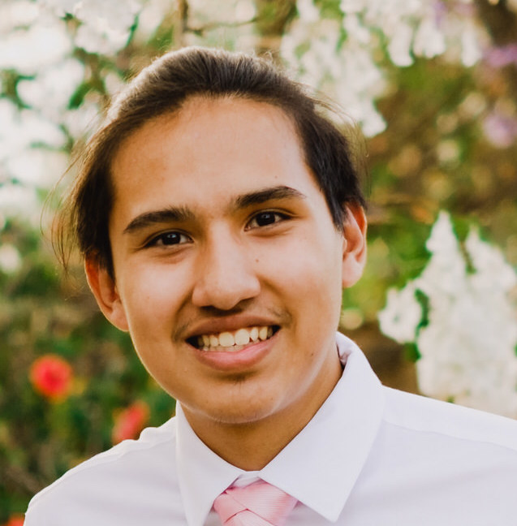
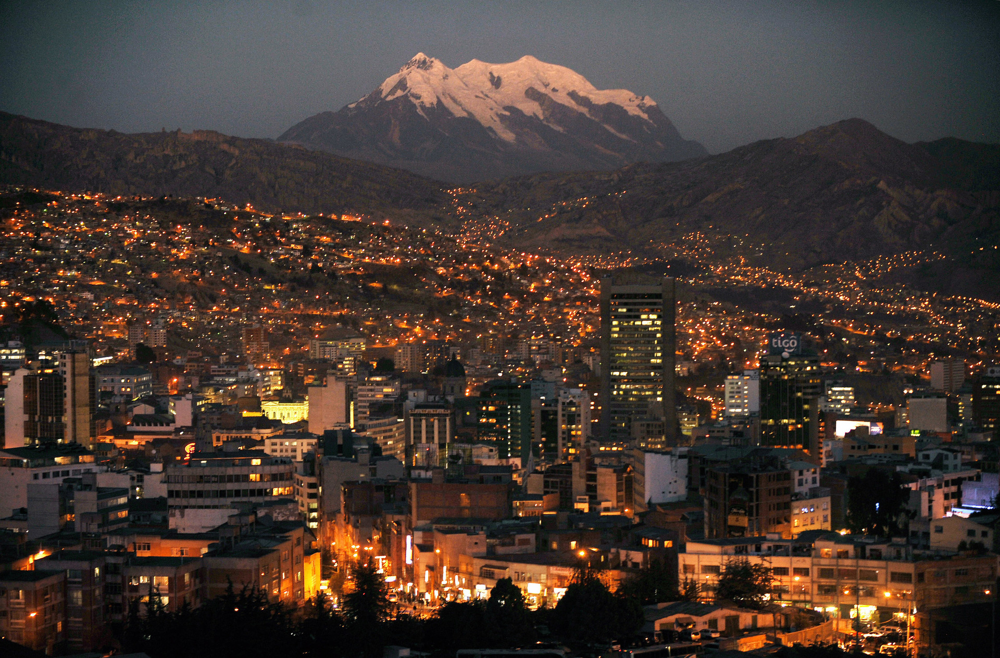
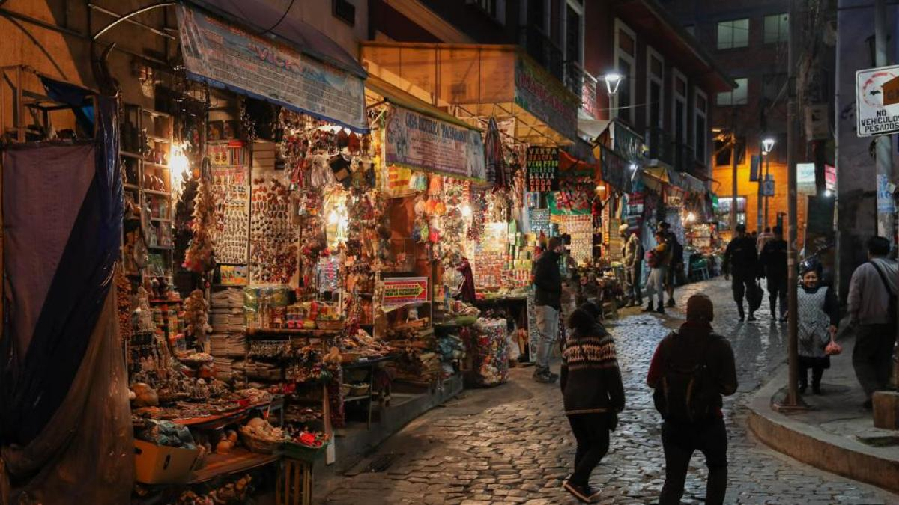
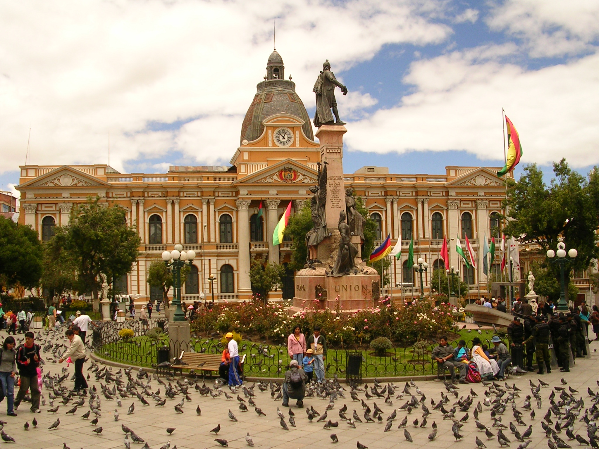

# Waynar Bocangel Calderon

## Index
1. About me
   - Who am I?
   - From Bolivia to San Diego
2. Projects
3. Hobies and Interests
## About me
### Who am I?
Hello everyone, my name is Waynar Bocangel Calderon and I am a 20 year old **Computer Engineering Undergradute Student** at the **_University of California San Diego!_** I am currently on my second year at UC San Diego, but I have learned a thing or two about Computer Science and Programming by this time. I was born in **_La Paz, Bolivia_** a city _12,000 feet above sea level_. You can see some pictures of my beautiful city right bellow:

_La Paz at night._

_A famous street in La Paz where people go buy products for witchcraft also known as **Calle de las Brujas** or **The Witches Street**._

_The main square in La Paz._

### From Bolivia to San Diego
In August of 2019 I left my hometown and moved to San Diego, California, a place I had never even visited before.