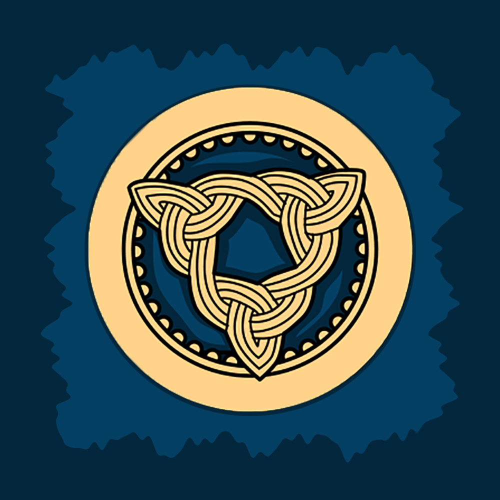

# Waynar Bocangel Calderon
<table>
    <tr>
        <td>
            <h3>Computer Engineering Major at the University of California San Diego</h3>
            
Welcome to my personal page! Here you will be able to learn some more about me, where I have been, and where I am headed.

        </td>
        <td>
            
        </td>
    </tr>
</table>

## Index
1. About me
   - Who am I?
   - From Bolivia to San Diego
2. Projects
   - Overview
   - BITFROST SRL
   - Freelancing
3. Hobies and Interests
4. Contact Information

## About me
### Who am I?
Hello everyone, my name is Waynar Bocangel Calderon and I am a 20 year old **Computer Engineering Undergradute Student** at the **_University of California San Diego!_** I am currently on my second year at UC San Diego, but I have learned a thing or two about Computer Science and Programming by this time. I was born in **_La Paz, Bolivia_** a city _12,000 feet above sea level_. You can see some pictures of my beautiful city right bellow:

_La Paz at night._

_A famous street in La Paz where people go buy products for witchcraft also known as **Calle de las Brujas** or **The Witches Street**._

_The main square in La Paz._

### From Bolivia to San Diego
In August of 2019 I left my hometown and moved to San Diego, California, a place I had never even visited before. Ever since I was eight I knew I wanted to work with computers and by the age of 12 I knew I wanted to build software, but I did not start coding until I was 16. Bolivia's universities unfurtunately do not offer any **Computer Science** degrees, and so I was determined to move to the United States for college. I got into several competitive schools, but my heart pulled me towards **_UC San Diego_** because of what my parents would call not relevant reasons. As a musician and music lover, the San Diego Music scene and the proximity to Los Angeles were key factors in deciding where I would go to study. In addition to that, factors like weather and closeness to the Bay Aread motivated me to have a leap of faith and choose UCSD as my college. I don't regret my decision!

Although I currently reside in La Paz due to the Covid-19 pandemic, moving to San Diego changed my life and my perception of everything in more positive ways than I can count. Having lived my whole life in the same city had limited my views of the world but my experiences with new people in new places have shown me how big world can be. Being payed to play music for the first time at the **_Che Cafe_** in UCSD's campus, learning about Computer Science and Engineering with some of the most brilliant people in the field, struggling with change and having a support sytem within one of the most welcoming places in the world has shown me who I am and where I would like to go after graduation.

## Projects
### Overview
When I first started Computer Engineering at UC San Diego I was not sure about the major was really about, and even less of what I could do with the knowledge I would gain. I have always had a strong calling for social work and as time passed I have learned more about what interests me in the industry I have discovered more about myself and my place society as a Software Engineer. Moving back to Bolivia for the past year has reminded me of how Software Engineering can change people's lifes for the better. That is why this past year I have focused on learning and mastering skills to develop software that can help others. Walt Disney said:
> The way to get started is to quit talking and begin doing.

That is why this past year for me has been about doing tangible goods for as many people as possible.

### BITFROST SRL

With this goal in mind I started a software development company this year. BITFROST SRL dedicates itself to the production of sustainable, affordable, and highly availble software. This endevour has taken me unexpected places across this past year as I develop my first large scale multi-platform application. I have learned of mobile and full-stack development to optimize our users' experience with our products. I have become proficient in: <b><i>Swift, ReactJS, JQuery, NodeJS, MongoDB, and JavaScript</i></b>. We are very exited about our first endevour: 

**Alexandria**

This is an educational app designed to help students organize the content of their classes into books, notebooks, documents, flashcards, amongst other things. When thinking about why is education so challenging to so many studntes we thought about how difficult it is to create logical organized content